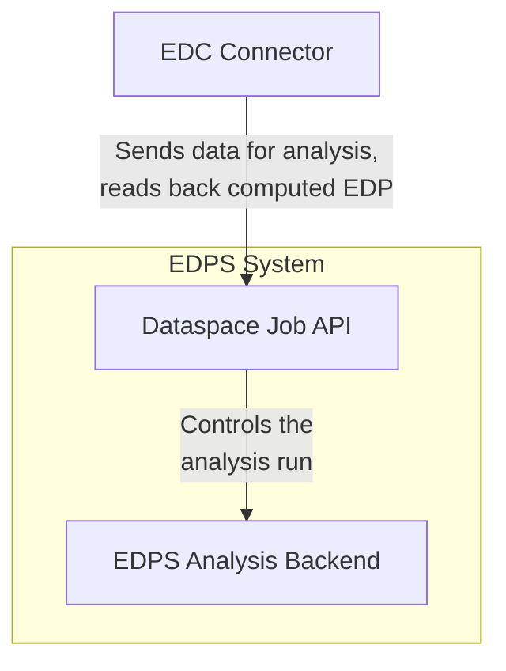
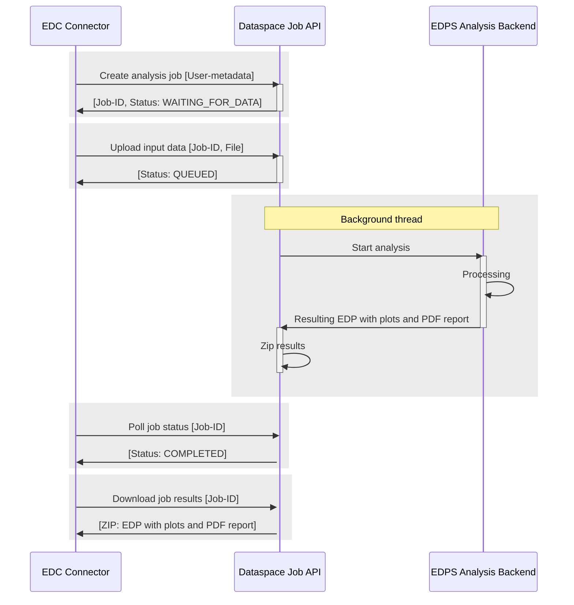

# Job API

The **Dataspace Job API** is the entrypoint for the **EDC Connector** into the **EDPS System**. It allows uploading data, starting the analysis job that is executed by the **EDPS Analysis Backend** and finally downloading the processing results. In this document we show the components involved and the steps to go through for an API user.

## Components

This is how the components work together on a high-level:

- EDC Connector: An external datahub uploads assets for analysis to the EDPS system and downloads the processing results (computed **EDP** with plots and PDF report).
- Dataspace Job API: Entrypoint for controlling analysis jobs. The API is specified in **OpenAPI**, supporting **SwaggerUI** and **ReDoc** among other tools.
- EDPS Analysis Backend: Processes the data and provides the results to the API.

## Processing steps

### Create job

First the **EDC Connector** creates a new analysis job by uploading the user-metadata to the API. The API returns the **job info** containing the randomly generated **Job-ID** and status (at this point **WAITING_FOR_DATA**).

### Upload data

Referring to the new job using **Job-ID** the caller uploads the raw input data (e.g. a CSV file) and provides its filename. The API again returns the **job info**, the status now being **QUEUED**.

### Process analysis job 

The API starts the analysis in a background process, changing the status to **PROCESSING**.
If the analysis was successful the results consisting of the computed EDP, plots and the PDF report are zipped and the status changes to **COMPLETED**.
In case of an error the status changes to **FAILED** and the error message is stored.

### Poll status

The client should poll for status updates passing the **Job-ID** until it reaches **COMPLETED** or **FAILED**. For a failed job an error message is returned.

### Download results

If the job reaches status **COMPLETED** the client can download the resulting ZIP file after passing the **Job-ID**.
